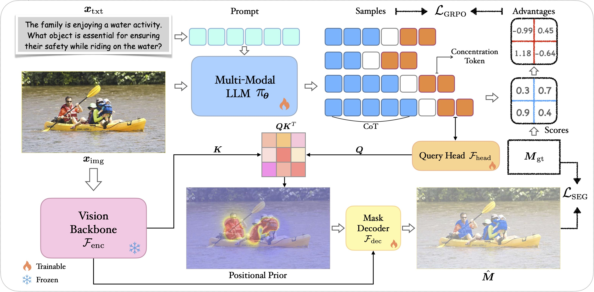
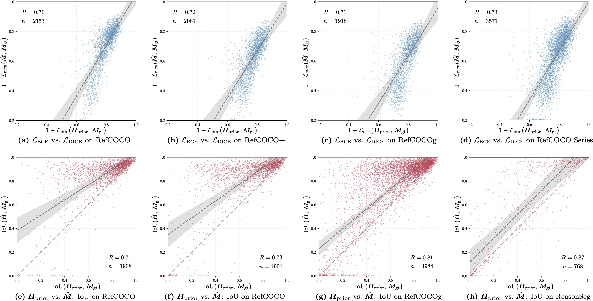
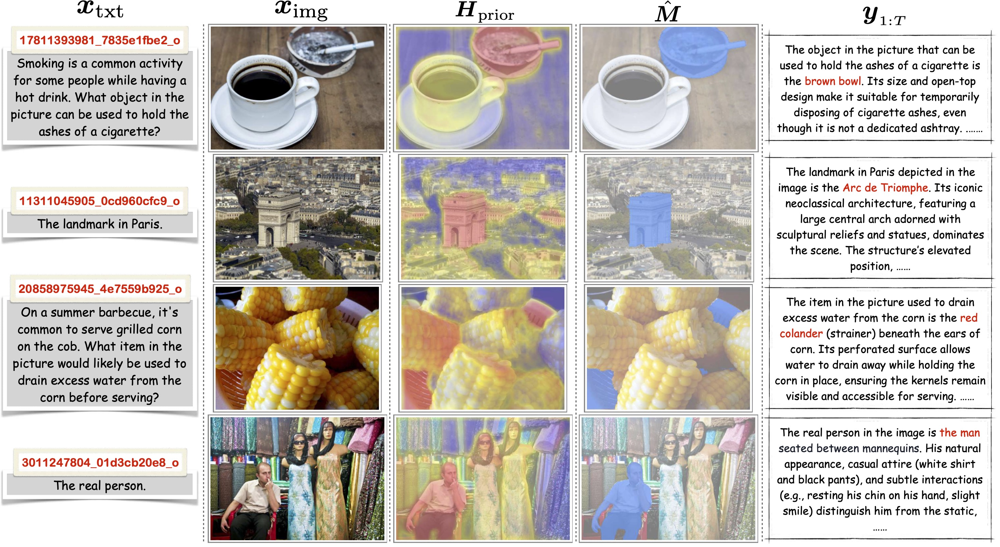

# CoPRS: Learning Positional Prior from Chain-of-Thought for Reasoning Segmentation

[Zhenyu Lu](https://github.com/ZhenyuLU-Heliodore), Liupeng Li, [Jinpeng Wang]( https://scholar.google.com/citations?user=853-0n8AAAAJ), Yan Feng, Bin Chen, Ke Chen, Yaowei Wang

[[`Paper`](https://arxiv.org/abs/2510.11173)] [[`Modeling`](https://github.com/ZhenyuLU-Heliodore/CoPRS/tree/main/verl/modeling.py)] [[`Datasets`](#datasets)] [[`Training`](https://github.com/ZhenyuLU-Heliodore/CoPRS/tree/main/verl/trainer)] [[`Local Deployment`](#local-deployment)] [[`BibTeX`](#citing-coprs)] [[`Contact`](#contact)]

CoPRS bridges language reasoning and segmentation via a **differentiable, interpretable positional prior**, instantiated as a heatmap.  
A learnable concentration token aggregates image–instruction context to generate this prior, which a lightweight decoder refines into precise masks.

<p align="center">
  
</p>
<p align="center"><em>Figure 2 (Overall Architecture): Given image and text, the policy generates CoT and a concentration token; the token queries image features to produce a positional prior, which is decoded into masks. Policy and segmentation modules are trained jointly.</em></p>

<p align="center">
  
</p>
<p align="center"><em>Figure 3 (Correlation): Correlation between the positional prior and the predicted mask during training and inference on RefCOCO(+/g) and ReasonSeg; each blue point is a training batch, each red point an inference instance; OLS regression lines with confidence bands show a strong positive association.</em></p>

<p align="center">
  
</p>
<p align="center"><em>Figure 4 (Visualizations): From left to right — image–text pair, positional prior, predicted mask, and chain-of-thought.</em></p>

## Datasets

This project uses the following segmentation datasets:

- [**RefCOCO**](https://huggingface.co/datasets/jxu124/refcoco)
- [**RefCOCO+**](https://huggingface.co/datasets/jxu124/refcocoplus)
- [**RefCOCOg**](https://huggingface.co/datasets/jxu124/refcocog)
- [**ReasonSeg**](https://drive.google.com/drive/folders/125mewyg5Ao6tZ3ZdJ-1-E3n04LGVELqy)

### Dataset Preprocessing

All dataset preprocessing scripts are located in the `preparation/data/` directory.

These scripts handle:
- Data format conversion  
- Image and annotation alignment  
- ReasonSeg-specific reasoning annotation processing  
- Offline computation of [SAM](https://github.com/facebookresearch/segment-anything/tree/main) image embedding

Make sure you download datasets to the expected directory structure before running preprocessing.
The download links for the above datasets have been provided.

## Training

The model is trained end-to-end with combined reasoning and segmentation objectives.  
This release includes the **model architecture** and the **training framework** (with distributed training support such as FSDP).

The trainer implementation is not included in this public release and will be released in a future update.


## Local Deployment
This repository supports local deployment and training on multi-GPU machines.  
We plan to provide a fully functional training pipeline based on **FSDP (Fully Sharded Data Parallel)** for efficient large-model training across multiple GPUs.

However, the current public release **does not include the trainer implementation**.  
The training scripts (e.g., `ray_trainer.py`, `scripts/train/`) are placeholders and will be released in a future update.

Stay tuned for updates.

## Citing CoPRS

If you use CoPRS in your research, please use the following BibTeX entry.

```
@article{lu2025coprs,
  title={CoPRS: Learning Positional Prior from Chain-of-Thought for Reasoning Segmentation},
  author={Lu, Zhenyu and Li, Liupeng and Wang, Jinpeng and Feng, Yan and Chen, Bin and Chen, Ke and Wang, Yaowei},
  journal={arXiv preprint arXiv:2510.11173},
  year={2025}
}
```

## Contact
If you have any questions, please contact **Zhenyu Lu** (<zhenyulu.heliodore@gmail.com>) or **Jinpeng Wang** (<wjp20@mails.tsinghua.edu.cn>).