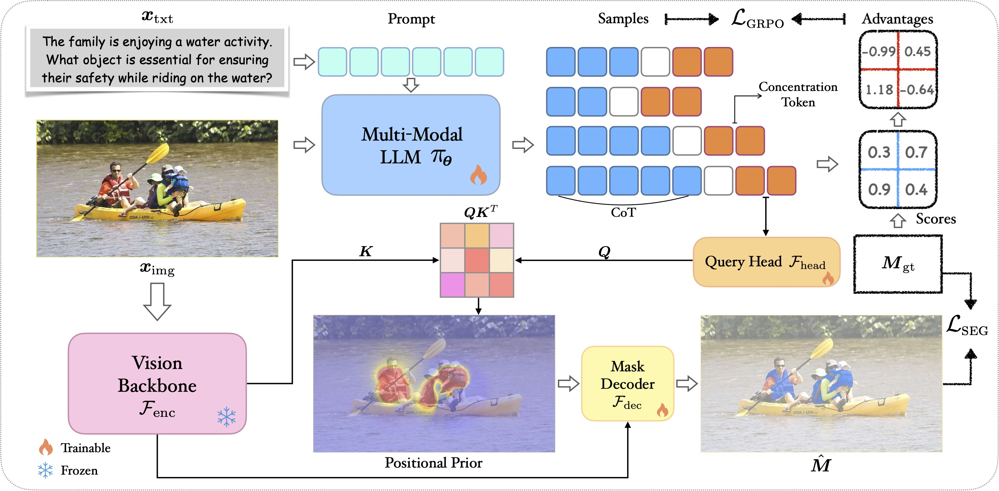
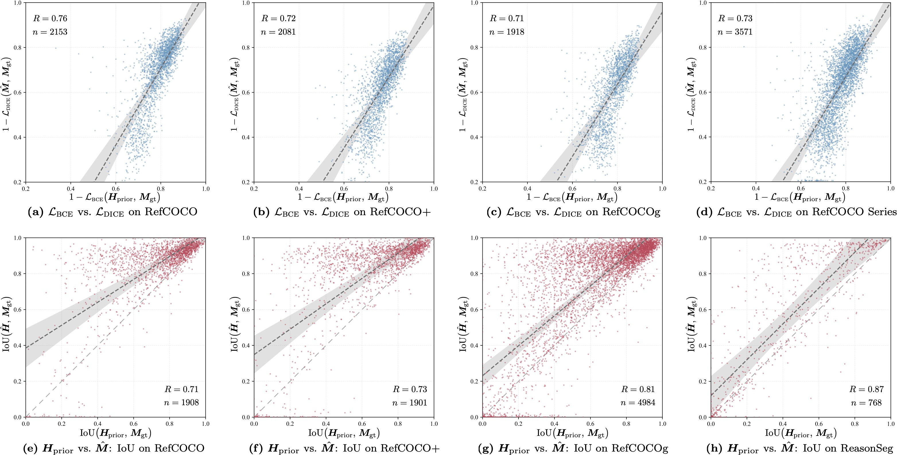
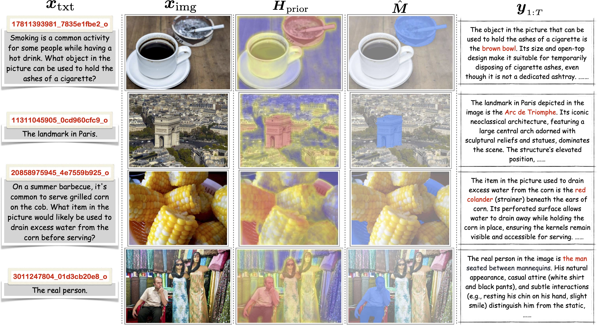

# CoPRS: Learning Positional Prior from Chain-of-Thought for Reasoning Segmentation

[Zhenyu Lu](https://github.com/ZhenyuLU-Heliodore), Liupeng Li, [Jinpeng Wang]( https://scholar.google.com/citations?user=853-0n8AAAAJ), Yan Feng, Bin Chen, Ke Chen, Yaowei Wang

[[`Paper`](https://arxiv.org/abs/2510.11173)] [[`Modeling`](https://github.com/ZhenyuLU-Heliodore/CoPRS/tree/main/verl/modeling.py)] [[`Preparation`](#preparation)] [[`Local Deployment`](#local-deployment)] [[`Training`](https://github.com/ZhenyuLU-Heliodore/CoPRS/tree/main/verl/trainer)] [[`BibTeX`](#citing-coprs)] [[`Contact`](#contact)]

## News
* **[2026/03]** Full Codebase Release. We have released the complete training pipeline and provided example scripts for both training and inference.
* **[2026/01]** CoPRS has been accepted to ICLR 2026.

CoPRS bridges language reasoning and segmentation via a **differentiable, interpretable positional prior**, instantiated as a heatmap.  
A learnable concentration token aggregates image–instruction context to generate this prior, which a lightweight decoder refines into precise masks.

<p align="center">
  
</p>
<p align="center"><em>Figure 2 (Overall Architecture): Given image and text, the policy generates CoT and a concentration token; the token queries image features to produce a positional prior, which is decoded into masks. Policy and segmentation modules are trained jointly.</em></p>

<p align="center">
  
</p>
<p align="center"><em>Figure 3 (Correlation): Correlation between the positional prior and the predicted mask during training and inference on RefCOCO(+/g) and ReasonSeg; each blue point is a training batch, each red point an inference instance; OLS regression lines with confidence bands show a strong positive association.</em></p>

<p align="center">
  
</p>
<p align="center"><em>Figure 4 (Visualizations): From left to right — image–text pair, positional prior, predicted mask, and chain-of-thought.</em></p>

> **Note**: This project is built upon [**VeRL**](https://github.com/volcengine/verl). The storage of code, data, and checkpoints, as well as the launching mechanism, are specifically designed for **distributed clusters**. Due to this architecture, the environment setup and path configurations are relatively complex. Please follow the instructions below carefully.

## Preparation

### Dataset

This project uses the following segmentation datasets:

- [**RefCOCO**](https://huggingface.co/datasets/jxu124/refcoco)
- [**RefCOCO+**](https://huggingface.co/datasets/jxu124/refcocoplus)
- [**RefCOCOg**](https://huggingface.co/datasets/jxu124/refcocog)
- [**ReasonSeg**](https://drive.google.com/drive/folders/125mewyg5Ao6tZ3ZdJ-1-E3n04LGVELqy)

### Dataset Preprocessing

All dataset preprocessing scripts are located in the `preparation/data/` directory.

These scripts handle:
- Data format conversion  
- Image and annotation alignment  
- ReasonSeg-specific reasoning annotation processing  
- Offline computation of [SAM](https://github.com/facebookresearch/segment-anything/tree/main) image embedding

Make sure you download datasets to the expected directory structure before running preprocessing.
The download links for the above datasets have been provided.

### Special Token Registration
To ensure proper handling of spatial coordinates and project-specific identifiers, you must register special tokens for the Qwen2.5-VL-7B/3B models before training.

Please use the provided [script](https://github.com/ZhenyuLU-Heliodore/CoPRS/blob/main/preparation/model/register_tokens.py).

Run this script to inject the required tokens into the tokenizer and model configuration, and **resize the embedding size**. The modified model should be saved to a new directory, which will then serve as the local checkpoint path for starting the Training process.

## Local Deployment

Stay tuned for updates.

### 2026/03/11 Updates
* **Environment**: Updated `requirements.txt` with necessary dependencies for distributed training.
* **Training Pipeline**: The full Trainer implementation and FSDP (Fully Sharded Data Parallel) workers are now integrated and available.
* **Getting Started**: Once you have completed the [Preparation](#preparation) and the token registration below, you can follow the [Training](#training) section to start multi-GPU training.

## Training

The model is trained end-to-end with combined reasoning and segmentation objectives.  
This release includes the **model architecture** and the **training framework** (with distributed training support such as FSDP).

### 2026/03/11 Updates
* **Pipeline Integration**: The full training pipeline has been integrated into the `verl/` directory.
* **Launch Scripts**: Example scripts for various configurations are provided in the `scripts/` directory, which launch the main trainer at `verl/trainer/main.py`.

### Training Execution
This project is designed for **distributed clusters**. Please note the following requirements:

* **Configurations**: All hyperparameters, file paths, and environment settings must be modified directly within the corresponding `.sh` files.
* **Working Directory**: You **must** run all commands from the **root directory** of this project.
* **Execution Command**:
    ```bash
    bash scripts/train/refcocog_train_8X80G.sh --root DIR
    ```
    * `DIR`: The absolute path to the parent directory on your server that contains the project's `data/`, `checkpoint/`, and other resources.
    * **Python Interpreter**: The scripts default to using the interpreter located at `DIR/coprs/bin/python`.
    * **Logs**: Standard output and error logs are redirected to `DIR/print_log.txt`.


## Citing CoPRS

If you use CoPRS in your research, please use the following BibTeX entry.

```
@article{lu2025coprs,
  title={CoPRS: Learning Positional Prior from Chain-of-Thought for Reasoning Segmentation},
  author={Lu, Zhenyu and Li, Liupeng and Wang, Jinpeng and Feng, Yan and Chen, Bin and Chen, Ke and Wang, Yaowei},
  journal={arXiv preprint arXiv:2510.11173},
  year={2025}
}
```

## Contact
If you have any questions, please contact **Zhenyu Lu** (<zhenyulu22@m.fudan.edu.cn>) or **Jinpeng Wang** (<wangjp26@gmail.com>).